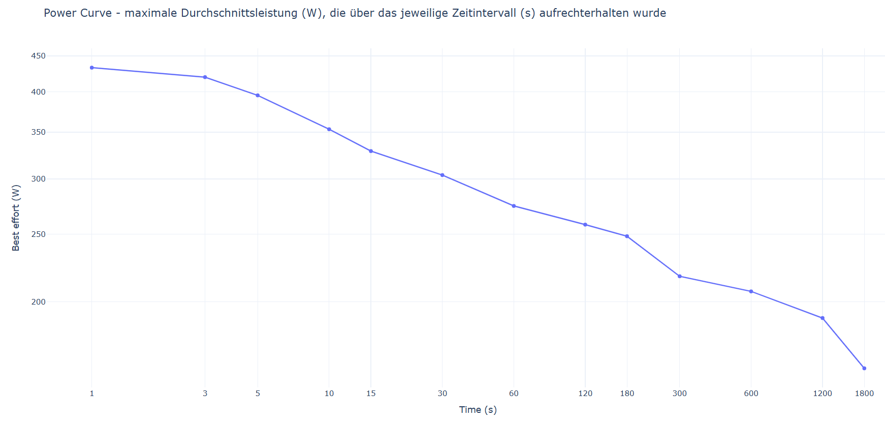

# Aufgabe_3-5
Programmierübung 2 von Julia Rössler &amp; Sophie Zembacher

## Aufgabe 3 - interaktiver Plot
Die App besteht aus einer Startseite und eienm Tab mit Daten. Auf der Startseite kann die Versuchsperson und ein Test mittels einem Drop-Down Menü ausgewählt werden. Im zweiten Tab kann die maximale Herzfrequenz eingegeben werden. Zusätzlich wird ein Plot mit der Leistung und der maximalen Herzfrequenz, welcher in die verschiedenen Herzzonen aufgeteilt ist, angezeigt. Außerdem wird die mittlere sowie die maximale Leistung ausgegeben. Des weiteren sind die verbrachte Zeit und Durchschnittswerte pro Zone angebracht.

Um die App starten zu können, muss das Repository gecloned werden Der Befehl "pdm init" muss jedoch nicht ausgeführt werden, da die Datei pyproject.toml, welche alle notwendigen Pakete beinhaltet, durch das clonen bereits existiert. Gestartet wird die App durch den Befehl "streamlit run main.py". 

Screenshots:

## Aufgabe 4 - Leistungskurve II
Diese Anwendung dient der Analyse von Leistungsdaten und visualisiert eine Power Curve – also die maximale Durchschnittsleistung, die über verschiedene Zeitintervalle hinweg erbracht wurde. Die Daten werden aus einer CSV-Datei mit Leistungswerten, die eine Spalte mit dem Namen „PowerOriginal“ enthält. Die Anwendung liest diese Datei ein, berechnet die jeweils höchste Durchschnittsleistung über frei definierbare Zeitfenster (z. B. 5 Sekunden, 1 Minute, 5 Minuten usw.) und stellt die Ergebnisse in einem interaktiven Plot dar.

Die App ist als PDM-Projekt aufgebaut. Nach dem Herunterladen oder Klonen des Projekts kann es mit Hilfe von PDM eingerichtet und gestartet werden. Dazu installiert man zunächst PDM (sofern nicht bereits vorhanden) über pip install pdm. Anschließend genügt ein pdm install, um alle notwendigen Abhängigkeiten zu installieren. Die Datei mit den Leistungsdaten (activity.csv) muss im Ordner data/activities/ liegen und die entsprechende Spalte PowerOriginal enthalten. Das eigentliche Skript wird anschließend über pdm run python app.py ausgeführt. Die Power Curve wird daraufhin automatisch in einem neuen Browserfenster geöffnet. 

Screenshot:

## Aufgabe 5 - Objektorientierung
Im Rahmen dieser Aufgabe wurde eine interaktive Streamlit-Anwendung zur Analyse und Visualisierung von EKG- und Leistungsdaten entwickelt. Die App ist als PDM-Projekt strukturiert und kombiniert moderne Visualisierungstechniken mit objektorientierter Programmierung.

Die Anwendung ermöglicht zunächst die Auswahl einer Testperson, zu der neben dem Namen auch das Geburtsdatum, Geschlecht, ein Profilbild und eine eindeutige ID angezeigt werden. Für jede ausgewählte Person können verschiedene EKG-Tests eingesehen werden. Die EKG-Daten werden mithilfe von Plotly interaktiv dargestellt. Dabei kommt eine Peak-Erkennung zum Einsatz, die automatisch Ausschläge im EKG-Signal identifiziert. Die erkannten Peaks werden visuell hervorgehoben und zur Berechnung der geschätzten Herzfrequenz in bpm verwendet. Zusätzlich besteht die Möglichkeit, den dargestellten Zeitraum des EKG-Signals individuell anzupassen. Dies erfolgt über die Eingabe von Start- und Endindex, sodass gezielt ein bestimmter Ausschnitt des Signals betrachtet und analysiert werden kann.

Neben der EKG-Analyse bietet die App auch eine Leistungsanalyse. Dabei werden durchschnittliche Werte für Herzfrequenz und Leistung in unterschiedlichen Zonen angezeigt, um Rückschlüsse auf die Belastungsintensität zu ermöglichen.

Um die App lokal auszuführen, muss zunächst das entsprechende GitHub-Repository geklont werden. Dies erfolgt über den Befehl git clone. Falls das Projekt bereits lokal vorhanden ist, können mit git pull aktuelle Änderungen aus dem Repository übernommen werden. Nach dem Klonen bzw. Aktualisieren sollten die erforderlichen Abhängigkeiten mithilfe der Datei requirements.txt installiert werden. Anschließend kann die Anwendung mit dem Befehl streamlit run app.py gestartet werden. Die App öffnet sich automatisch im Browser und ist sofort einsatzbereit.

Screenshots:

