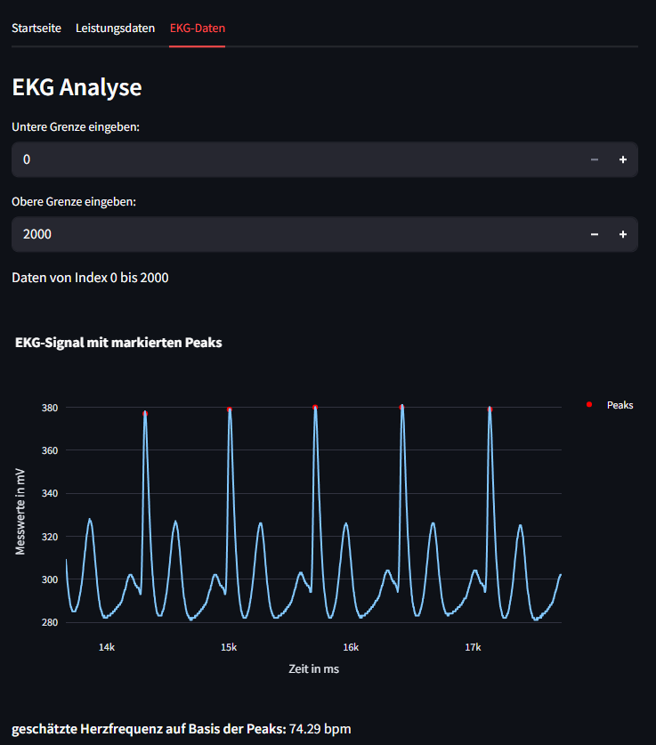

# Aufgabe_3-5
Programmierübung 2 von Julia Rössler &amp; Sophie Zembacher

## Aufgabe 3 - interaktiver Plot
Die App besteht aus einer Startseite und eienm Tab mit Daten. Auf der Startseite kann die Versuchsperson und ein Test mittels einem Drop-Down Menü ausgewählt werden. Im zweiten Tab kann die maximale Herzfrequenz eingegeben werden. Zusätzlich wird ein Plot mit der Leistung und der maximalen Herzfrequenz, welcher in die verschiedenen Herzzonen aufgeteilt ist, angezeigt. Außerdem wird die mittlere sowie die maximale Leistung ausgegeben. Des weiteren sind die verbrachte Zeit und Durchschnittswerte pro Zone angebracht.

Um die App starten zu können, muss das Repository gecloned werden Der Befehl "pdm init" muss jedoch nicht ausgeführt werden, da die Datei pyproject.toml, welche alle notwendigen Pakete beinhaltet, durch das clonen bereits existiert. Gestartet wird die App durch den Befehl "streamlit run main.py". 

Screenshots:

## Aufgabe 4 - Leistungskurve II
Diese Anwendung dient der Analyse von Leistungsdaten und visualisiert eine Power Curve – also die maximale Durchschnittsleistung, die über verschiedene Zeitintervalle hinweg erbracht wurde. Die Daten werden aus einer CSV-Datei mit Leistungswerten, die eine Spalte mit dem Namen „PowerOriginal“ enthält. Die Anwendung liest diese Datei ein, berechnet die jeweils höchste Durchschnittsleistung über frei definierbare Zeitfenster (z. B. 5 Sekunden, 1 Minute, 5 Minuten usw.) und stellt die Ergebnisse in einem interaktiven Plot dar.

Die App ist als PDM-Projekt aufgebaut. Nach dem Herunterladen oder Klonen des Projekts kann es mit Hilfe von PDM eingerichtet und gestartet werden. Dazu installiert man zunächst PDM (sofern nicht bereits vorhanden) über pip install pdm. Anschließend genügt ein pdm install, um alle notwendigen Abhängigkeiten zu installieren. Die Datei mit den Leistungsdaten (activity.csv) muss im Ordner data/activities/ liegen und die entsprechende Spalte PowerOriginal enthalten. Das eigentliche Skript wird anschließend über pdm run python app.py ausgeführt. Die Power Curve wird daraufhin automatisch in einem neuen Browserfenster geöffnet. 

Screenshot:

## Aufgabe 5 - Objektorientierung
Diese App ermöglicht nun die Analyse und Visualisierung von EKG-Daten und von Leistungsdaten aus verschiedenen Tests. Die Anwendung basiert auf **Streamlit** und ist als **PDM-Projekt** aufgesetzt. 
neue Funktionen:
- Auswahl und Darstellung von Testpersonen (inkl. Bild und Basisdaten wie Name, Geburtsdatum, Geschlecht und id)
- Visualisierung von EKG Daten in einem interaktiven Plot durch **Plotly** mit Peak-Erkennung 
- Ablesen der geschätzten Herzfrequenz auf Basis der Peaks
- Anzeige durchschnittlicher Leistungs- und HF-Daten pro Zone

Um die App zu starten, muss zunächst wieder das Repository von GitHub auf den eigenen Rechner geklont werden. Dazu wird der Befehl git clone verwendet.Falls das Repository bereits zuvor geklont wurde, können Änderungen aus dem GitHub-Repository jederzeit mit dem Befehl git pull auf den lokalen Rechner übertragen und das Projekt aktualisiert werden. Anschließend müssen die benötigten Abhängigkeiten installiert werden. Mit dem Befehl "streamlit run app.py" kann die App aktiv gestartet werden. Nach dem Start öffnet sich die Anwendung automatisch im Browser. 

Screenshots:

